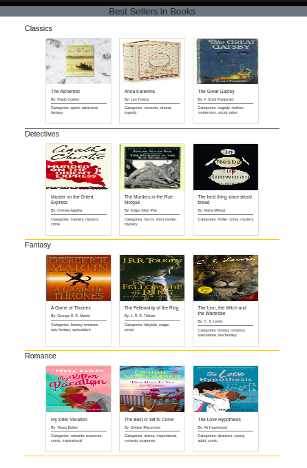

# Book Lists

## **Instructions**:

- In the `data.js` file, you can find a data structure for the details included the images and categories of books.
- Export the data structure as a JSON string.
- Import the JSON string into the `index.js` file.
- In the `index.js` file, create a program to transform the data from the JSON string and display every book as a card with image, title, author and categories.

